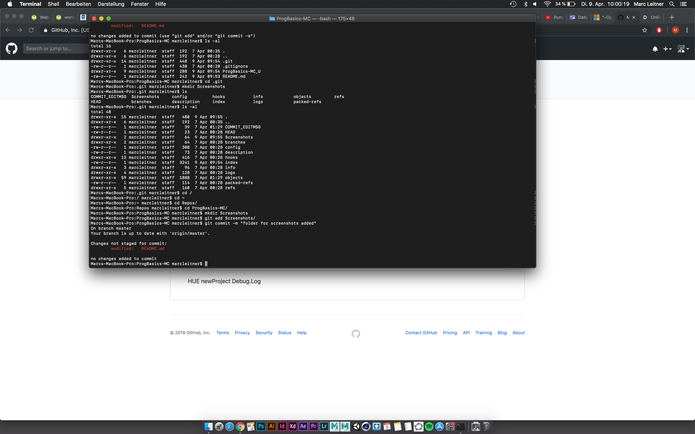

# ProgBasics-MC

 ##### Status: Projekt in Work 
 ##### Progress: 100%
# 
#
### Development Plattform: 
- MacOs Mojave 10.14.3
- Unity 2018.2.14f
- Visual Studio 7.7.4
- Scriping Runtime Version: .Net 3.5 Equivalent
- API Compatibility Level: .Net 2.0 Subset

### Description: 
 ProgBasics Übung 

### Target Plattform:
Standalone, WebGL, Mobile incl. reference resolution

#### Screenshots:

### Third Party Material: 
if used Fonts, Sounds, Music, Graphics, Materials, Code etc.

### Lessons Learned:
Operatoren, Methode, Variablen 

> Copyright by Marc Leitner aka MC Scurry  

